# KSQL DB QUERIES

## Launch the KSQL Shell:

```
### Syntax:
ksql <KSQL SERVER ADDRESS>

### Example
ksql http://worker1.bigdata.com:8088
```

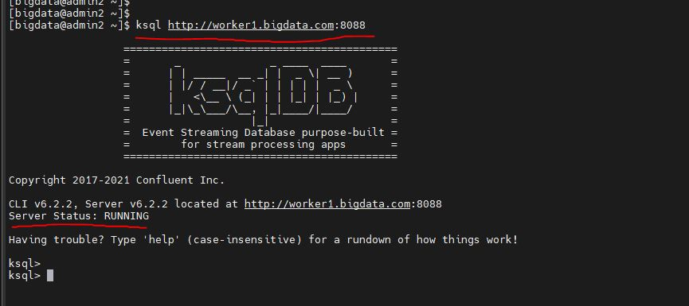

---

## List

### List Topics

```
ksql> LIST TOPICS;
```
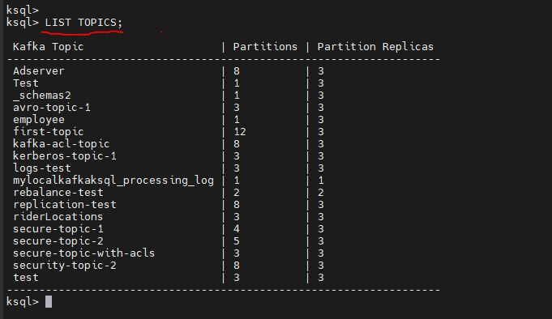

### List STREAMS

```
ksql> LIST STREAMS;
```
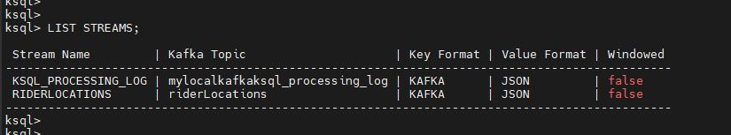

### List TABLES

```
ksql> LIST TABLES;
```
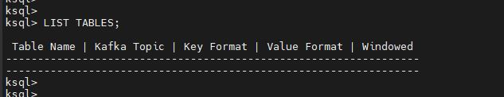

---

## Resetting OFFSETS
### Moving offsets to earliest
```
ksql> SET 'auto.offset.reset'='earliest';
```

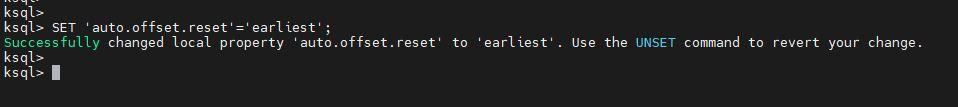

### Moving offsets to latest
```
ksql> SET 'auto.offset.reset'='latest';
```

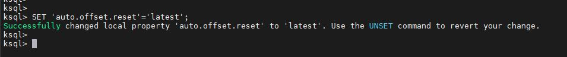

### To UNSET the offsets

```
ksql> UNSET 'auto.offset.reset';
```

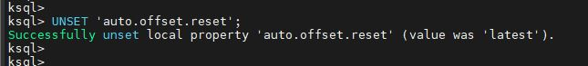

---
## View / Print Messages in a Topic

### View Messages in Topic with default value of auto.offset.reset=latest

```
### Syntax
ksql> PRINT '<topic_name>';

### Example
ksql> PRINT 'logs-test';
```

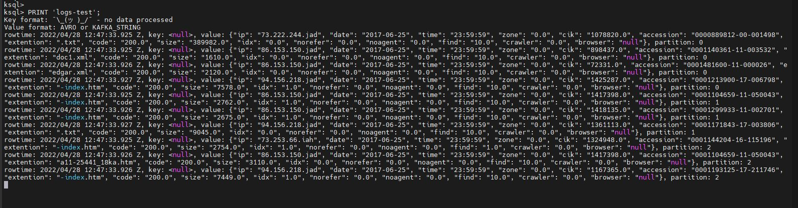

### View Messages in Topic with default value of auto.offset.reset=earliest

```
### Syntax
ksql> PRINT '<topic_name>' FROM BEGINNING;

### Example
ksql> PRINT 'logs-test' FROM BEGINNING;
```

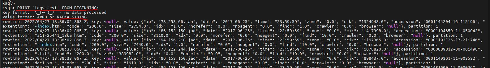

### View Messages in Topic with default value of auto.offset.reset=earliest & Limit to number of messages

```
### Syntax
ksql> PRINT '<topic_name>' FROM BEGINNING LIMIT <Number of Messages>;

### Example
ksql> PRINT 'logs-test' FROM BEGINNING LIMIT 5;
```

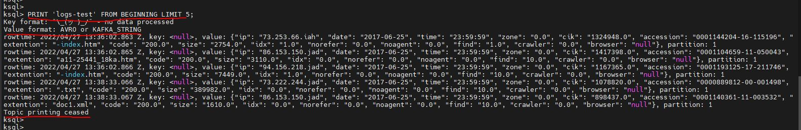

---

## Create STREAM

### Create STREAM on a TOPIC with STRING / TEXT fields

#### Produce Message via Kafka Console Producer

```
# kafka-console-producer \
    --broker-list  worker1.bigdata.com:9094,worker2.bigdata.com:9094,worker3.bigdata.com:9094 \
    --topic secure-topic-with-acls \
    --producer.config /home/bigdata/kerberos/kafka_client_kerberos_acl.properties

>Hello!
>This is the message from Topic 'test'
>Testing KSQL Queries
>Thanks!
```

```
ksql> LIST TOPICS;

ksql> PRINT 'secure-topic-with-acls';

### Creating STREAM on topic 'secure-topic-with-acls' which has STRING / TEXT messages / data
### VALUE_FORMAT='KAFKA' -- This support all the primitive types in Kafka (STRING, INT, BOOLEAN, etc)

ksql> CREATE OR REPLACE STREAM IF NOT EXISTS SECURE_STREAM1(message STRING) WITH (KAFKA_TOPIC='secure-topic-with-acls', VALUE_FORMAT='KAFKA');

ksql> LIST STREAMS;

ksql> SELECT * FROM SECURE_STREAM1 EMIT CHANGES;
```

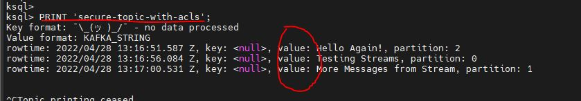
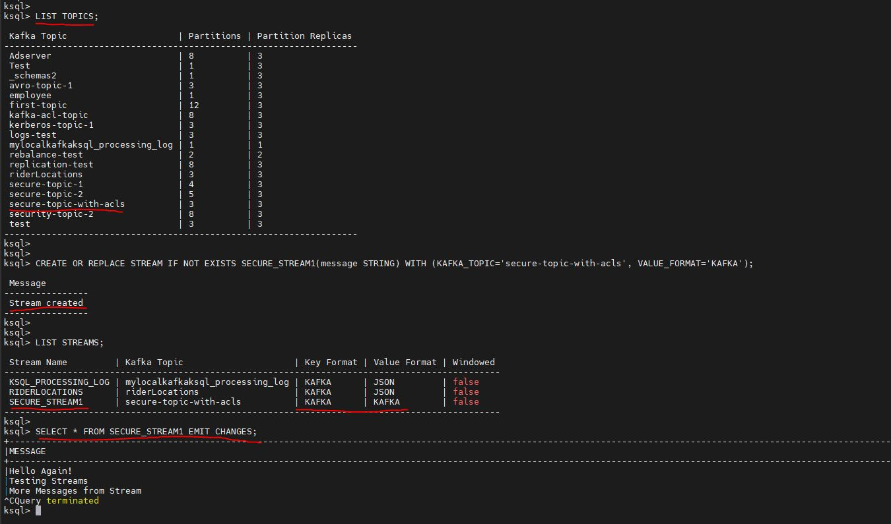

### Create STREAM on a TOPIC with DELIMITED fields

#### Produce Message via Kafka Console Producer

```
# kafka-console-producer \
    --broker-list  worker1.bigdata.com:9094,worker2.bigdata.com:9094,worker3.bigdata.com:9094 \
    --topic secure-topic-1 \
    --producer.config /home/bigdata/kerberos/kafka_client_kerberos_acl.properties

>123,Alison,John,USA,10000
>121,Ajay,Krishna,IND,15000
>132,Emily,Johnson,UK,12000
```

```
ksql> LIST TOPICS;

ksql>  PRINT 'secure-topic-1' FROM BEGINNING;

### Creating STREAM on topic 'secure-topic-1' which has DELIMITED fields / messages / data
### FORMAT='DELIMITED' -- To mention the delimited data
### VALUE_DELIMITER=',' -- The Delimiter

ksql> CREATE OR REPLACE STREAM IF NOT EXISTS SECURE_STREAM2(
    id INT, 
    first_name STRING,
    last_name STRING,
    country STRING,
    salary INT
) WITH (
    KAFKA_TOPIC='secure-topic-1',
    FORMAT='DELIMITED',
    VALUE_DELIMITER=','
);

ksql> LIST STREAMS;

ksql> SET 'auto.offset.reset'='earliest';

ksql> SELECT * FROM SECURE_STREAM2 EMIT CHANGES;
```

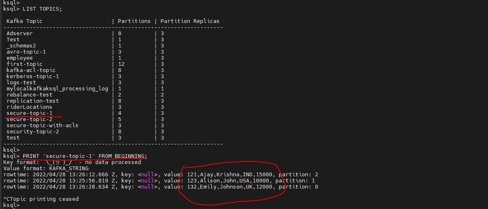

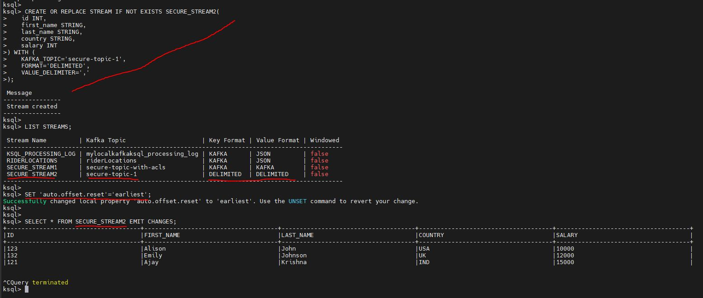

### Create STREAM on a TOPIC with JSON Data / Messages

#### Produce Message via Kafka Console Producer

```
# kafka-console-producer \
    --broker-list  worker1.bigdata.com:9094,worker2.bigdata.com:9094,worker3.bigdata.com:9094 \
    --topic secure-topic-2 \
    --producer.config /home/bigdata/kerberos/kafka_client_kerberos_acl.properties

>{"id": 121, "first_name": "Alice", "last_name": "John", "country": "USA", "salary": 10000, "heigth": 173.5, "weight": 76.3}
>{"id": 122, "first_name": "Ajay", "last_name": "Krisha", "country": "IND", "salary": 15000, "heigth": 175.3, "weight": 68.6}
>{"id": 123, "first_name": "Emiley", "last_name": "Johnson", "country": "UK", "salary": 12000, "heigth": 163.5, "weight": 73.5}
>{"id": 124, "first_name": "Shane", "last_name": "Watson", "country": "AUS", "salary": 11000, "heigth": 171.5, "weight": 78.9}

```

```
ksql> LIST TOPICS;

ksql>  PRINT 'secure-topic-2' FROM BEGINNING;

### Creating STREAM on topic 'secure-topic-2' which has JSON messages / data
### VALUE_FORMAT='JSON' -- JSON data

ksql> CREATE OR REPLACE STREAM IF NOT EXISTS SECURE_STREAM3 ( 
    id INT, 
    first_name STRING,
    last_name STRING,
    country STRING,
    salary INT,
    heigth DOUBLE,
    weight DOUBLE
) WITH (
    KAFKA_TOPIC='secure-topic-2',
    VALUE_FORMAT='JSON'
);

ksql> LIST STREAMS;

ksql> SET 'auto.offset.reset'='earliest';

ksql> SELECT * FROM SECURE_STREAM3 EMIT CHANGES;
```

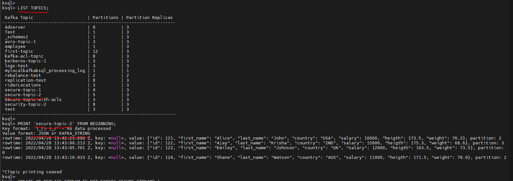

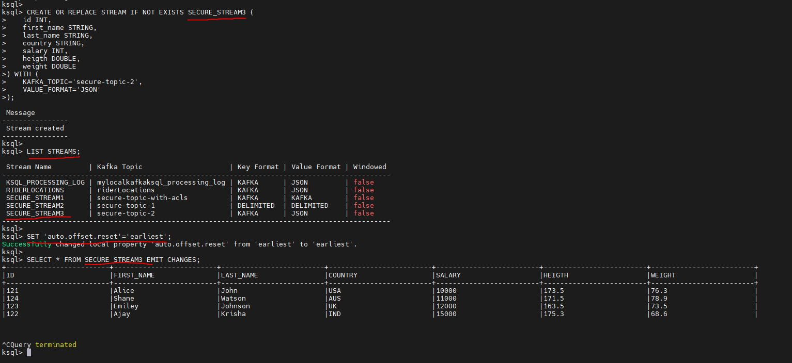

### Create STREAM on a TOPIC with AVRO Data / Messages

#### Produce Message via Kafka Console Producer

```
# kafka-avro-console-producer \
    --broker-list worker1.bigdata.com:9094,worker2.bigdata.com:9094,worker3.bigdata.com:9094 \
    --topic employee \
    --producer.config /home/bigdata/kerberos/kafka_client_kerberos_acl.properties \
    --property schema.registry.url=http://admin2.bigdata.com:8081 \
    --property value.schema.id=2

{"eid": 111, "ename": "Alice", "esalary": 10000, "edept": "IT", "eage": 25}
{"eid": 112, "ename": "Bob", "esalary": 13000, "edept": "CSE", "eage": 24}
{"eid": 113, "ename": "Charlie", "esalary": 11000, "edept": "MECH", "eage": 22}
{"eid": 114, "ename": "Dave", "esalary": 12000, "edept": "IT", "eage": 27}

```

```
ksql> LIST TOPICS;

ksql>  PRINT 'employee' FROM BEGINNING;

### Creating STREAM on topic 'employee' which has AVRO messages / data
### VALUE_FORMAT='AVRO' -- AVRO Data

ksql> CREATE OR REPLACE STREAM IF NOT EXISTS EMPLOYEE_STREAM ( 
    eid INT, 
    ename STRING,
    esalary INT,
    edept STRING,
    eage INT
) WITH (
    KAFKA_TOPIC='employee',
    VALUE_FORMAT='AVRO',
    VALUE_SCHEMA_ID=4
);

ksql> LIST STREAMS;

ksql> SET 'auto.offset.reset'='earliest';

ksql> SELECT * FROM EMPLOYEE_STREAM EMIT CHANGES;
```

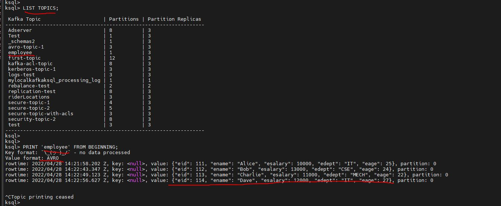

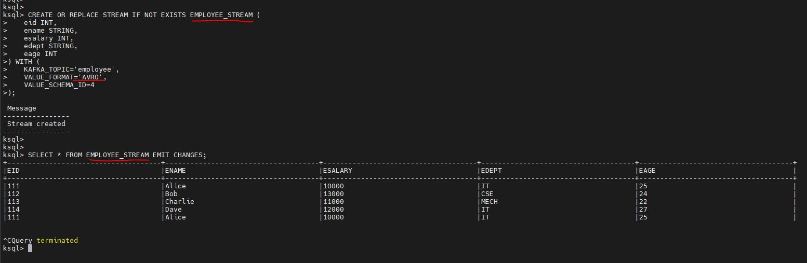
