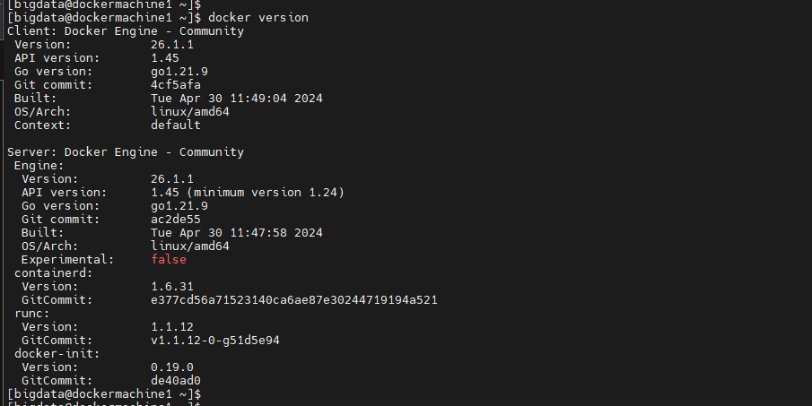

# Pre-requisites

* Docker Engine - v26.1.3+
* Docker Compose - v2.27.1
* Internet
* Optional - IDE (IntelliJ Idea, VSCode, Notepad++, etc)
* Basic Linux commands

### Install Docker

Refer, this [README](https://github.com/AshokKumarChoppadandi/dev-environments/tree/develop/DockerSetupOnCentOS7) for installation of `docker` and `docker-compose` in CentOS

### Docker & Docker Compose Version:

The following is the command used to check `docker` version:

```
docker version
```



The following is the command used to check `docker-compose` version:

```
docker-compose version
```


### Testing Docker Installation:

Running a hello-world docker container:

```
docker run hello-world
```


***Docker and Docker Compose are successful installed and configured in the system***