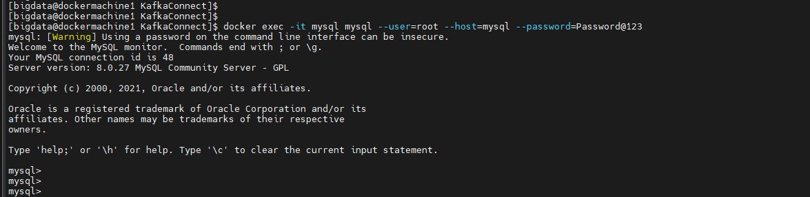
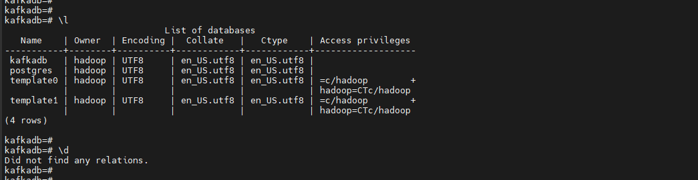
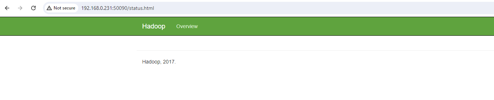
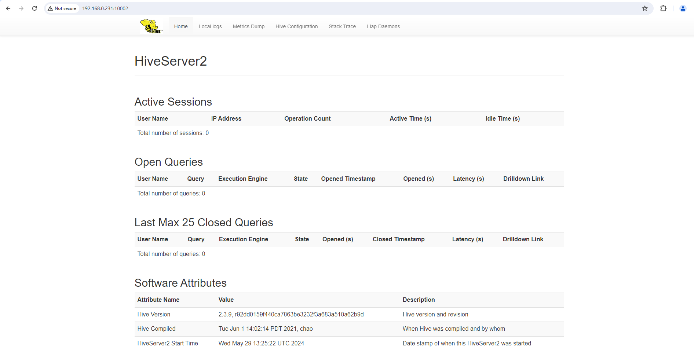
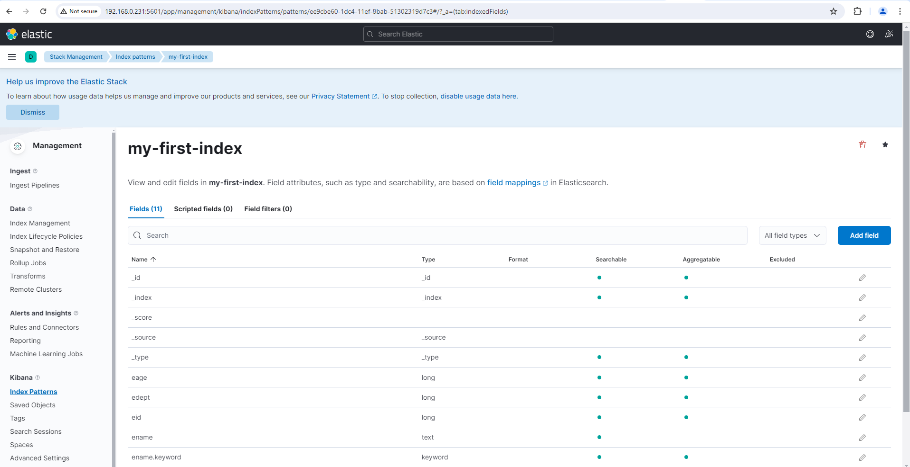

# Environment Setup for Kafka Connect Usecases

### [Pre-requisites](https://github.com/AshokKumarChoppadandi/StreamingExamples/blob/master/KafkaConnect/1-Pre-requisites.md)

### Docker Network

#### List docker networks

```
docker network ls
```


#### Create docker network

As the complete setup will be in Docker containers, a common docker network is required to connect all the running docker containers on the Physical host.

The following is the command used to create the docker network:

```
docker network create -d bridge bigdata_cluster
```


OR

It is also possible to create the docker network within the docker-compose file as follows:

```
cat 1-create-docker-network.yaml
```

```
networks:
  bigdata_cluster:
    name: bigdata_cluster
    driver: bridge
```

*Note: This won't work if no services are added the docker-compose file.*

# IMAGE

### RDBMS Databases

The following is the docker compose file used for setting up MySQL and PostgreSQL databases:

```
cat 2-rdbms.yaml
```

```
networks:
  bigdata_cluster:
    name: bigdata_cluster
    external: true
services:
  mysql:
    image: ashokkumarchoppadandi/mysql:latest
    networks:
      - bigdata_cluster
    hostname: mysql
    container_name: mysql
    restart: always
    environment:
      MYSQL_ROOT_PASSWORD: Password@123
      MYSQL_DATABASE: metastore
    ports:
      - "3306:3306"
    healthcheck:
      test: mysqladmin ping -h 127.0.0.1 -u root --password=$$MYSQL_ROOT_PASSWORD
      interval: 10s
      timeout: 20s
      retries: 3
      start_period: 30s
  
  postgres:
    image: postgres:13
    hostname: postgres
    container_name: postgres
    networks:
      - bigdata_cluster
    environment:
      POSTGRES_DB: kafkadb
      POSTGRES_USER: hadoop
      POSTGRES_PASSWORD: Password@123
    ports:
      - "5432:5432"
    healthcheck:
      test: pg_isready -h 127.0.0.1 -U postgres -p 5432
      interval: 10s
      timeout: 20s
      retries: 3
      start_period: 30s
```


The file can be downloaded form [here]()

#### Start RDBMs containers

```
docker-compose -f 2-rdbms.yaml up -d
```


#### Status Check

```
docker-compose -f 2-rdbms.yaml ps -a
```

*Note: Wait for all the containers to become `Healthy`.*


#### Testing & Validating RDBMs'

##### MySQL

Login to MySQL shell from the container:

```
docker exec -it mysql mysql -u root -h mysql -pPassword@123
```




##### PostgreSQL

```
docker exec -it postgres psql -U hadoop -h postgres -d kafkadb
```


*Note: This will prompt for password, enter the `password` that is provided in the docker-compose file.*



### Confluent Kafka Cluster

The following is the docker compose file used for setting up the Confluent Kafka Cluster with the below components:
* Zookeeper
* Kafka Server
* Schema Registry
* Kafka Connect Server
* KSQL DB Server

```
cat > 3-confluent-kafka-cluster.yaml
```

```
networks:
  bigdata_cluster:
    name: bigdata_cluster
    external: true
services:
  zookeeper:
    image: ashokkumarchoppadandi/confluent-kafka:7.5.4-stream8-with-connectors
    networks:
      - bigdata_cluster
    ports:
      - "2181:2181"
    hostname: zookeeper
    container_name: zookeeper
    restart: always
    environment:
      ZOOKEEPER_CLIENT_PORT: 2181
      ZOOKEEPER_MAX_CLIENT_CONNECTIONS: 0
      ZOOKEEPER_TICK_TIME: 2000
      ZOOKEEPER_ENABLE_SERVER: "false"
      ZOOKEEPER_ADMIN_SERVER_PORT: 8080
    command:
      - zookeeper
      - standalone

  broker:
    image: ashokkumarchoppadandi/confluent-kafka:7.5.4-stream8-with-connectors
    networks:
      - bigdata_cluster
    depends_on:
      zookeeper:
        condition: service_healthy
        restart: true
    hostname: broker
    container_name: broker
    restart: always
    environment:
      BROKER_ID: 0
      KAFKA_LISTENER_SECURITY_PROTOCOL_MAP: "INTERNAL:PLAINTEXT,EXTERNAL:PLAINTEXT"
      KAFKA_LISTENERS: INTERNAL:\/\/0.0.0.0:9092,EXTERNAL:\/\/0.0.0.0:29092
      KAFKA_ADVERTISED_LISTENERS: INTERNAL:\/\/broker:9092,EXTERNAL:\/\/localhost:29092
      KAFKA_INTER_BROKER_LISTENER_NAME: "INTERNAL"
      NUM_NETWORK_THREADS: 3
      NUM_IO_THREADS: 8
      SOCKET_SEND_BUFFER_BYTES: 102400
      SOCKET_RECEIVE_BUFFER_BYTES: 102400
      SOCKET_REQUEST_MAX_BYTES: 104857600
      NUM_PARTITIONS: 1
      NUM_RECOVERY_THREADS_PER_DATA_DIR: 1
      OFFSETS_TOPIC_REPLICATION_FACTOR: 1
      TRANSACTION_STATE_LOG_REPLICATION_FACTOR: 1
      TRANSACTION_STATE_LOG_MIN_ISR: 1
      LOG_RETENTION_HOURS: 168
      LOG_SEGMENT_BYTES: 1073741824
      LOG_RETENTION_CHECK_INTERVAL_MS: 300000
      ZOOKEEPER_CONNECT_LIST: "zookeeper:2181"
      ZOOKEEPER_CONNECTION_TIMEOUT_MS: 18000
      GROUP_INITIAL_REBALANCE_DELAY_MS: 0
    ports:
      - "29092:29092"
    command: kafka

  schemaregistry:
    image: ashokkumarchoppadandi/confluent-kafka:7.5.4-stream8-with-connectors
    networks:
      - bigdata_cluster
    depends_on:
      broker:
        condition: service_healthy
        restart: true
    hostname: schemaregistry
    container_name: schemaregistry
    restart: always
    environment:
      SCHEMA_REGISTRY_LISTENERS: http:\/\/0.0.0.0:8081
      KAFKASTORE_BOOTSTRAP_SERVERS: "broker:9092"
      KAFKASTORE_TOPIC: "_schemas"
      DEBUG: "true"
    ports:
      - "8081:8081"
    command: schemaregistry

  connect:
    image: ashokkumarchoppadandi/confluent-kafka:7.5.4-stream8-with-connectors
    networks:
      - bigdata_cluster
    depends_on:
      broker:
        condition: service_healthy
        restart: true
      schemaregistry:
        condition: service_healthy
        restart: true
    hostname: connect
    container_name: connect
    restart: always
    environment:
      CONNECT_WITH_AVRO_DISTRIBUTED: "true"
      BOOTSTRAP_SERVERS: broker:9092
      GROUP_ID: connect-cluster
      KEY_CONVERTER: io.confluent.connect.avro.AvroConverter
      KEY_CONVERTER_SCHEMA_REGISTRY_URL: http:\/\/schemaregistry:8081
      VALUE_CONVERTER: io.confluent.connect.avro.AvroConverter
      VALUE_CONVERTER_SCHEMA_REGISTRY_URL: http:\/\/schemaregistry:8081
      KEY_CONVERTER_SCHEMAS_ENABLE: "true"
      VALUE_CONVERTER_SCHEMAS_ENABLE: "true"
      OFFSET_STORAGE_TOPIC: connect-offsets
      OFFSET_STORAGE_REPLICATION_FACTOR: 1
      OFFSET_STORAGE_PARTITIONS: 25
      CONFIG_STORAGE_TOPIC: connect-configs
      CONFIG_STORAGE_REPLICATION_FACTOR: 1
      STATUS_STORAGE_TOPIC: connect-status
      STATUS_STORAGE_REPLICATION_FACTOR: 1
      STATUS_STORAGE_PARTITIONS: 5
      OFFSET_FLUSH_INTERVAL_MS: 10000
      CONNECT_REST_HOST: 0.0.0.0
      CONNECT_REST_PORT: 8083
      CONNECT_REST_ADVERTISED_HOST: connect
      CONNECT_REST_ADVERTISED_PORT: 8083
    ports:
      - "8083:8083"
    command: connect

  ksql:
    image: ashokkumarchoppadandi/confluent-kafka:7.5.4-stream8-with-connectors
    networks:
      - bigdata_cluster
    depends_on:
      broker:
        condition: service_healthy
        restart: true
      schemaregistry:
        condition: service_healthy
        restart: true
    hostname: ksql
    container_name: ksql
    restart: always
    environment:
      BOOTSTRAP_SERVERS: "broker:9092"
      KSQL_DB_LISTENERS: http:\/\/0.0.0.0:8088
      KSQL_LOGGING_PROCESSING_TOPIC_AUTO_CREATE: "true"
      KSQL_LOGGING_PROCESSING_STREAM_AUTO_CREATE: "true"
      KSQL_LOGGING_PROCESSING_ROWS_INCLUDE: "true"
      KSQL_SCHEMA_REGISTRY_URL: http:\/\/schemaregistry:8081
      UI_ENABLED: "true"
      KSQL_STREAMS_AUTO_OFFSET_RESET: latest
      KSQL_STREAMS_COMMIT_INTERVAL_MS: 2000
      KSQL_STREAMS_CACHE_MAX_BYTES_BUFFERING: 10000000
      KSQL_FAIL_ON_DESERIALIZATION_ERROR: "true"
      KSQL_STREAMS_NUM_STREAM_THREADS: 1
      KSQL_SERVICE_ID: default_
      KSQL_SINK_PARTITIONS: 4
      KSQL_SINK_REPLICAS: 1
    ports:
      - "8089:8088"
    command: ksql
```

#### Start Confluent Kafka Cluster

```
docker-compose -f 3-confluent-kafka-cluster.yaml up -d
```


#### Status Confluent Kafka Cluster

```
docker-compose -f 3-confluent-kafka-cluster.yaml ps -a
```


*Note: Wait for all the containers to become `Healthy`.*

#### Testing & Validating Confluent Kafka Cluster

##### Zookeeper

Login to Zookeeper Container:

```
docker exec -it zookeeper sh
```


Login to Zookeeper Shell:

```
zookeeper-shell zookeeper:2181
```


Execute to Zookeeper Commands:

```
ls /

get /clusters/id
```


##### Kafka Server

Login to Kafka Broker Container:

```
docker exec -it broker sh
```


List Kafka Topics:

```
kafka-topics --bootstrap-server broker:9092 --list
```


Create Kafka Topic:

```
kafka-topics --bootstrap-server broker:9092 --create --topic first-topic --partitions 3 --replication-factor 1
```


Describe Kafka Topic:

```
kafka-topics --bootstrap-server broker:9092 --describe --topic first-topic
```


Produce Data:

```
kafka-console-producer --broker-list broker:9092 --topic first-topic
```

```
Hi
Hello
How are you?
Bye!
```


Consume Data:

```
kafka-console-consumer --bootstrap-server broker:9092 --topic first-topic --from-beginning
```


##### Schema Registry

Check the following URL:

```
http://host_machine_name_or_ip_address:8081/subjects
```

Example:

```
http://192.168.0.231:8081/subjects
```


##### Kafka Connect

Check the following URL:

```
http://host_machine_name_or_ip_address:8083/
```

Example:

```
http://192.168.0.231:8083/connectors
```


##### KSQL DB Server

Check the following URL:

```
http://host_machine_name_or_ip_address:8089/
```

Example:

```
http://192.168.0.231:8089/
```


### Hadoop Cluster

The following is the docker compose file used for setting up the Hadoop Cluster with the below components:

*Note: MySQL (Hive Metastore) - Not included in the below docker-compose file but it is required to have Hive. This assumes that MySQL container is already in the same docker network.*

* Namenode
* Secondary Namenode
* MR History Server
* Resource Manager
* Hive Server2
* Slavenode - (Datanode & Node Manager)

```
cat 4-hadoop-cluster.yaml
```

```
networks:
  bigdata_cluster:
    name: bigdata_cluster
    external: true
services:
  namenode:
    image: ashokkumarchoppadandi/apache-hadoop-hive:2.7.6-2.3.8-stream8
    networks:
      - bigdata_cluster
    ports:
      - "50071:50070"
    hostname: namenode
    container_name: namenode
    restart: always
    environment:
      FS_DEFAULT_NAME: hdfs://namenode:9000
      DFS_REPLICATION: 1
      YARN_RESOURCEMANAGER_HOSTNAME: resourcemanager
      HISTORY_SERVER_HOST: historyserver
      JAVAX_JDO_OPTION_CONNECTIONURL: jdbc:mysql://mysql/metastore?createDatabaseIfNotExist=true
    command: namenode

  secondarynamenode:
    image: ashokkumarchoppadandi/apache-hadoop-hive:2.7.6-2.3.8-stream8
    networks:
      - bigdata_cluster
    depends_on:
      namenode:
        condition: service_healthy
        restart: true
    ports:
      - "50091:50090"
    hostname: secondarynamenode
    container_name: secondarynamenode
    restart: always
    environment:
      FS_DEFAULT_NAME: hdfs://namenode:9000
      DFS_REPLICATION: 1
      YARN_RESOURCEMANAGER_HOSTNAME: resourcemanager
      HISTORY_SERVER_HOST: historyserver
      JAVAX_JDO_OPTION_CONNECTIONURL: jdbc:mysql://mysql/metastore?createDatabaseIfNotExist=true
    command: secondarynamenode

  resourcemanager:
    image: ashokkumarchoppadandi/apache-hadoop-hive:2.7.6-2.3.8-stream8
    networks:
      - bigdata_cluster
    depends_on:
      namenode:
        condition: service_healthy
        restart: true
    ports:
      - "18088:8088"
    hostname: resourcemanager
    container_name: resourcemanager
    restart: always
    environment:
      FS_DEFAULT_NAME: hdfs://namenode:9000
      DFS_REPLICATION: 1
      YARN_RESOURCEMANAGER_HOSTNAME: resourcemanager
      HISTORY_SERVER_HOST: historyserver
      JAVAX_JDO_OPTION_CONNECTIONURL: jdbc:mysql://mysql/metastore?createDatabaseIfNotExist=true
    command: resourcemanager

  historyserver:
    image: ashokkumarchoppadandi/apache-hadoop-hive:2.7.6-2.3.8-stream8
    networks:
      - bigdata_cluster
    depends_on:
      namenode:
        condition: service_healthy
        restart: true
      resourcemanager:
        condition: service_healthy
        restart: true
    ports:
      - "19889:19888"
    hostname: historyserver
    container_name: historyserver
    restart: always
    environment:
      FS_DEFAULT_NAME: hdfs://namenode:9000
      DFS_REPLICATION: 1
      YARN_RESOURCEMANAGER_HOSTNAME: resourcemanager
      HISTORY_SERVER_HOST: historyserver
      JAVAX_JDO_OPTION_CONNECTIONURL: jdbc:mysql://mysql/metastore?createDatabaseIfNotExist=true
    command: historyserver

  hiveserver2:
    image: ashokkumarchoppadandi/apache-hadoop-hive:2.7.6-2.3.8-stream8
    networks:
      - bigdata_cluster
    depends_on:
      namenode:
        condition: service_healthy
        restart: true
      resourcemanager:
        condition: service_healthy
        restart: true
      historyserver:
        condition: service_healthy
        restart: true
      # mysql:
        # condition: service_healthy
        # restart: true
    ports:
      - "10002:10002"
    hostname: hiveserver2
    container_name: hiveserver2
    restart: always
    environment:
      FS_DEFAULT_NAME: hdfs://namenode:9000
      DFS_REPLICATION: 1
      YARN_RESOURCEMANAGER_HOSTNAME: resourcemanager
      HISTORY_SERVER_HOST: historyserver
      JAVAX_JDO_OPTION_CONNECTIONURL: jdbc:mysql://mysql/metastore?createDatabaseIfNotExist=true
    command:
      - hiveserver2

  slavenode:
    image: ashokkumarchoppadandi/apache-hadoop-hive:2.7.6-2.3.8-stream8
    networks:
      - bigdata_cluster
    depends_on:
      namenode:
        condition: service_healthy
        restart: true
      secondarynamenode:
        condition: service_healthy
        restart: true
      resourcemanager:
        condition: service_healthy
        restart: true
      historyserver:
        condition: service_healthy
        restart: true
      hiveserver2:
        condition: service_healthy
        restart: true
    ports:
      - "18042:8042"
      - "35945:35945"
      - "4040:4040"
    hostname: slavenode
    container_name: slavenode
    restart: always
    environment:
      FS_DEFAULT_NAME: hdfs://namenode:9000
      DFS_REPLICATION: 1
      YARN_RESOURCEMANAGER_HOSTNAME: resourcemanager
      HISTORY_SERVER_HOST: historyserver
      JAVAX_JDO_OPTION_CONNECTIONURL: jdbc:mysql://mysql/metastore?createDatabaseIfNotExist=true
    command:
      - slavenode
```

#### Start Hadoop Cluster

```
docker-compose -f 4-hadoop-cluster.yaml up -d
```


### Hadoop Cluster Status Check

```
docker-compose -f 4-hadoop-cluster.yaml ps -a
```


*Note: Wait for all the containers to become `Healthy`.*

#### Testing & Validating Hadoop Cluster

##### Namenode:

```
http://docker_host_machine_ip_or_hostname:50070/
```

Example:

```
http://192.168.0.231:50070/
```


##### Secondary Namenode:

```
http://docker_host_machine_ip_or_hostname:50090/
```

Example:

```
http://192.168.0.231:50090/
```



##### MR History Server:

```
http://docker_host_machine_ip_or_hostname:19888/
```

Example:

```
http://192.168.0.231:19888/
```


##### Resource Manager:

```
http://docker_host_machine_ip_or_hostname:8098/
```

Example:

```
http://192.168.0.231:8088/
```


##### Hive Server:

```
http://docker_host_machine_ip_or_hostname:10002/
```

Example:

```
http://192.168.0.231:10002/
```



##### Slave Node:

Login to Slavenode:

```
docker exec -it slavenode sh
```


List HDFS Files:

```
hdfs dfs -ls -R /
```


Run PI Map Reduce Program:

```
yarn jar /usr/local/hadoop/share/hadoop/mapreduce/hadoop-mapreduce-examples-2.7.6.jar pi 10 20
```


### Elasticsearch Cluster and Kibana

The following is the docker compose file used for setting up the Elasticsearch Cluster with the below components:

*Note: To run Elasticsearch container, it is mandatory to set `vm.max_map_count = 262144` on the docker host machine, if not Elasticsearch container won't run*

* Elasticsearch
* Kibana

```
cat 5-elasticsearch-kibana.yaml
```

```
networks:
  bigdata_cluster:
    name: bigdata_cluster
    external: true
services:
  elasticsearch01:
    image: ashokkumarchoppadandi/elasticsearch:7.17.0
    hostname: elasticsearch01
    container_name: elasticsearch01
    networks:
      - bigdata_cluster
    ports:
      - "9200:9200"
      - "9300:9300"
    environment:
      HOSTNAME: elasticsearch01
      ES_CLUSTER_NAME: my-elasticsearch
      ES_NODE_NAME: elasticsearch01
      ES_NODE_MASTER: "true"
      ES_DATA_PATH: "/usr/local/elasticsearch/data/"
      ES_LOGS_PATH: "/usr/local/elasticsearch/logs/"
      ES_NETWORK_HOST: 0.0.0.0
      ES_HTTP_PORT: 9200
      ES_BOOTSTRAP_MEMORY_LOCK: "true"
      ES_DISCOVERY_SEED_HOSTS: "127.0.0.1, [::1]"
      ES_MASTER_NODES: elasticsearch01
      ES_JAVA_OPTS: "-Xms512m -Xmx512m"
    ulimits:
      memlock:
        soft: -1
        hard: -1
    healthcheck:
      test: curl --fail "http://127.0.0.1:$$ES_HTTP_PORT/" || exit 1
      interval: 30s
      timeout: 10s
      retries: 5
      start_period: 10s

  kibana01:
    image: ashokkumarchoppadandi/kibana:7.17.0
    hostname: kibanahost1
    container_name: kibanahost1
    depends_on:
      elasticsearch01:
        condition: service_healthy
        restart: true
    networks:
      - bigdata_cluster
    ports:
      - "5601:5601"
    environment:
      ELASTICSEARCH_HOSTS: "http://elasticsearch01:9200"
      KIBANA_SERVER_PORT: 5601
      KIBANA_SERVER_HOST: 0.0.0.0
      KIBANA_SERVER_NAME: kibanahost1
    healthcheck:
      test: curl --fail "http://127.0.01:$$KIBANA_SERVER_PORT/" || exit 1
      interval: 10s
      timeout: 20s
      retries: 3
      start_period: 30s
```


#### Start Elasticsearch Cluster and Kibana

```
docker-compose -f 5-elasticsearch-kibana.yaml up -d
```


#### Elasticsearch Cluster and Kibana Status Check

```
docker-compose -f 5-elasticsearch-kibana.yaml ps -a
```


#### Testing & Validating Elasticsearch Cluster & Kibana

##### Elasticsearch

```
http://docker_host_machine_ip_or_hostname:9200/
```

Example:

```
http://192.168.0.231:9200/
```


##### Kibana

```
http://docker_host_machine_ip_or_hostname:5601/
```

Example:

```
http://192.168.0.231:5601/
```


##### Create Elasticsearch Index

Navigate to Dev Tools:


Create Index:

```
PUT my-first-index
{
  "settings": {
    "index": {
      "number_of_shards": 3,
      "number_of_replicas": 1
    }
  }
}
```


##### Insert data into Elasticsearch Index

```
PUT /my-first-index/_doc/1
{
    "eid" : 1,
    "ename" : "AAA",
    "eage": 25,
    "esalary": 15000,
    "edept": 901
}


PUT /my-first-index/_doc/2
{
    "eid" : 2,
    "ename" : "BBB",
    "eage": 28,
    "esalary": 18000,
    "edept": 902
}

PUT /my-first-index/_doc/3
{
    "eid" : 3,
    "ename" : "CCC",
    "eage": 23,
    "esalary": 12000,
    "edept": 903
}
```


##### Read data from Elasticsearch Index

```
GET my-first-index/_search
{
  "query": {
    "match_all": {}
  }
}
```


##### Read data from Kibana

Create Index Pattern:




Navigate to Discover Page:


